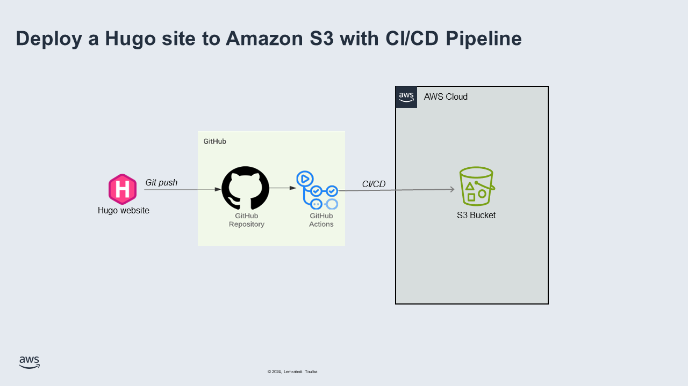

## Introduction
Deploying a static website can often seem daunting, especially when aiming for automation and continuous integration/continuous deployment (CI/CD). Hugo, a popular static site generator, simplifies the creation process. Coupled with Amazon S3 for hosting and GitHub Actions for automation, you can set up a robust CI/CD pipeline to deploy your Hugo site seamlessly. This guide will walk you through the steps to deploy a Hugo site to Amazon S3 using GitHub Actions in 2024.

## Prerequisites
Before we dive into the setup, ensure you have the following:
- A Hugo site ready for deployment.
- An AWS account with S3 permissions.
- A GitHub account.
- Basic knowledge of YAML syntax and Git.

## Setting Up Your Hugo Site
First, if you haven't already, set up your Hugo site:

```bash
# Install Hugo
brew install hugo

# Create a new Hugo site
hugo new site my-hugo-site

# Navigate to the site directory
cd my-hugo-site

# Add a theme (optional | e.g., Ananke)
git init
git submodule add https://github.com/theNewDynamic/gohugo-theme-ananke.git themes/ananke
echo 'theme = "ananke"' >> config.toml

# Create some content
hugo new posts/my-first-post.md
```
- **You can also add your theme manually:**
    - Choose your prefered theme by visiting: 🔗[Complete List | Hugo Themes](https://themes.gohugo.io)
    - Clone it into your project, using `git clone your-choosen-theme-repository-url`

## Configuring Amazon S3
Next, configure your S3 bucket to host the static site:
- **Create an S3 Bucket:**
    - Go to the S3 console and create a new bucket.
    - Name the bucket (e.g., my-hugo-site).
- **Set Bucket Permissions:**
    - Enable static website hosting in the bucket properties.
    - Set the index document to index.html.
    - Set the error document to 404.html.
- **Bucket Policy:**
    - Add a bucket policy to make the content publicly accessible. Replace your-bucket-name with your actual bucket name: 
```json
{
    "Version": "2012-10-17",
    "Statement": [
        {
            "Effect": "Allow",
            "Principal": "*",
            "Action": "s3:GetObject",
            "Resource": "arn:aws:s3:::your-bucket-name/*"
        }
    ]
}
```
- **Create an IAM User:**
    - Create a new IAM user with programmatic access.
    - Attach a policy to grant the user permission to upload to S3:
```json
{
  "Version": "2012-10-17",
  "Statement": [
    {
      "Effect": "Allow",
      "Action": "s3:PutObject",
      "Resource": "arn:aws:s3:::your-bucket-name/*"
    }
  ]
}
```
    - Note down the Access Key ID and Secret Access Key

## Setting Up GitHub Repository
Initialize a Git repository and push your Hugo site to GitHub:
```bash
# Initialize Git
git init
git remote add origin https://github.com/yourusername/my-hugo-site.git

# Commit and push your site
git add .
git commit -m "Initial commit"
git push -u origin master
```

## Creating GitHub Actions Workflow
Create a GitHub Actions workflow to automate the deployment process:

- **Create Workflow File:**
    - Create a workflow file under .github/workflows in your project
    - Make sure the file configuration is in `YAML` format 
- **Configure Workflow:**
    - Bellow is an exemple of a workflow file configuration
```yaml
name: Deploy Hugo Site to S3

on:
  push:
    branches:
      - master

jobs:
  build:
    runs-on: ubuntu-latest

    steps:
    - name: Checkout code
      uses: actions/checkout@v3

    - name: Setup Hugo
      uses: peaceiris/actions-hugo@v2
      with:
        hugo-version: 'latest'

    - name: Install dependencies
      run: |
        npm install

    - name: Build site
      run: |
        hugo

    - name: Deploy to S3
      uses: jakejarvis/s3-sync-action@v0.5.0
      with:
        args: --acl public-read --follow-symlinks --delete
      env:
        AWS_S3_BUCKET: ${{ secrets.AWS_S3_BUCKET }}
        AWS_ACCESS_KEY_ID: ${{ secrets.AWS_ACCESS_KEY_ID }}
        AWS_SECRET_ACCESS_KEY: ${{ secrets.AWS_SECRET_ACCESS_KEY }}
        SOURCE_DIR: 'public'
```
    - Push your local code to your GitHub repository.
- **Add Secrets:**
    In your GitHub repository, go to `Settings` > `Secrets` and add the following secrets:
    - `AWS_S3_BUCKET`: Your S3 bucket name.
    - `AWS_ACCESS_KEY_ID`: Your IAM user's access key ID.
    - `AWS_SECRET_ACCESS_KEY`: Your IAM user's secret access key.


## Testing the CI/CD Pipeline
Push a commit to the `main` branch to trigger the workflow:
```bash
git add .
git commit -m "Trigger deployment"
git push origin master
```
Monitor the `Actions` tab in your GitHub repository to ensure the workflow runs successfully. Once completed, your Hugo site should be deployed to your S3 bucket.

## Congratulations 🎉🥳 
You have successfully set up a CI/CD pipeline to deploy your Hugo site to Amazon S3 using GitHub Actions. 

This automated process ensures that your site is always up-to-date with the latest changes, making your workflow more efficient and reliable. 

## Source:
- 🔗[Hugo Documentation](https://gohugo.io/documentation/) - Comprehensive guide on Hugo static site generator, including installation and usage instructions.
- 🔗[AWS S3 Documentation](https://docs.aws.amazon.com/AmazonS3/latest/userguide/Welcome.html) - Detailed information on configuring and using Amazon S3 for static website hosting.
- 🔗[GitHub Actions Documentation](https://docs.github.com/en/actions) - Official documentation on setting up and configuring GitHub Actions for CI/CD pipelines.
- 🔗[Peaceiris GitHub Actions for Hugo](https://github.com/peaceiris/actions-hugo) - GitHub Actions for building and deploying Hugo sites.
- 🔗[Jake Jarvis S3 Sync Action](https://github.com/jakejarvis/s3-sync-action) - GitHub Action for syncing files and directories to an S3 bucket.
- 🔗[Amazon S3 Simple Storage Service](https://medium.com/handpro/amazon-s3-simple-storage-service-c02f39ac8c6c) - Medium article written by **Pr. Unubold Tumenbayar** explaining Amazon S3 and its features for storage and static website hosting.